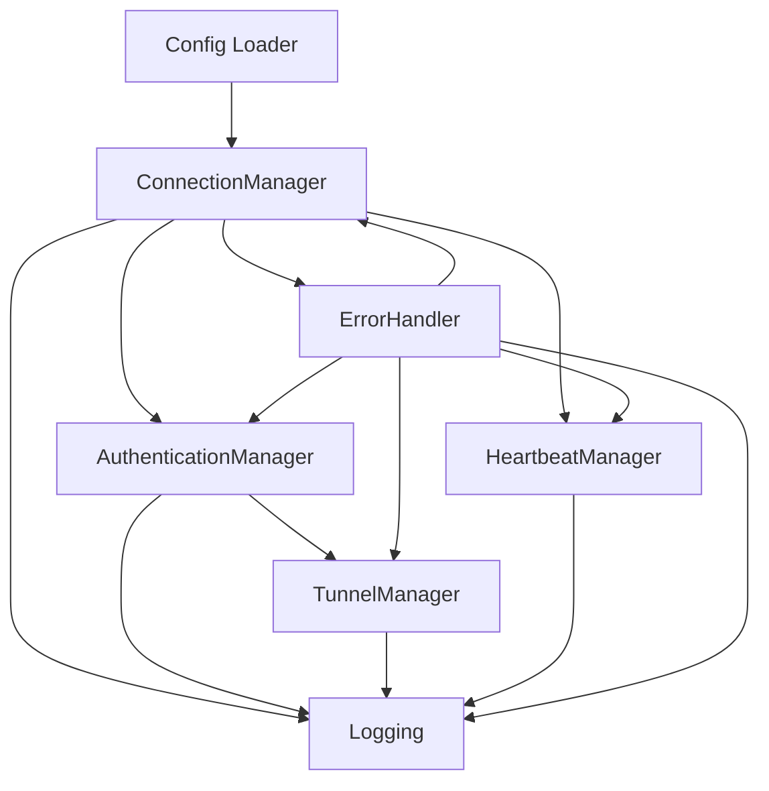

# Architecture Overview: CloudBridge Relay Client

## Main Components

- **ConnectionManager**: Establishes and maintains secure TLS 1.3 connections to the relay server.
- **AuthenticationManager**: Handles JWT and Keycloak authentication, token validation, and claim extraction.
- **TunnelManager**: Manages tunnel creation, validation, and lifecycle (local/remote port mapping, proxying).
- **HeartbeatManager**: Periodically sends heartbeat messages to monitor connection health and trigger reconnection if needed.
- **ErrorHandler**: Centralized error handling, retry logic, and exponential backoff for transient errors.
- **Config**: Loads and validates configuration from YAML, environment variables, and CLI flags.
- **Logging**: Structured logging with configurable level and format.

## Data Flow

1. **Startup**: Load config → parse CLI/env → validate
2. **Connect**: Establish TLS 1.3 connection to relay
3. **Hello**: Exchange hello/hello_response messages (protocol negotiation)
4. **Authenticate**: Send JWT/Keycloak token, receive auth_response
5. **Tunnel**: Send tunnel_info, receive tunnel_response, start proxy
6. **Heartbeat**: Periodically send heartbeat, handle heartbeat_response
7. **Error Handling**: On error, apply retry/backoff or shutdown gracefully

## Component Interaction Diagram

## Extensibility
- New authentication methods can be added via AuthenticationManager
- Additional tunnel types or protocols can be added to TunnelManager
- Logging and monitoring can be integrated via Logging component

## Security Boundaries
- All network traffic is encrypted (TLS 1.3)
- Tokens and secrets are never logged
- All errors and retries are logged for audit

## See Also
- `docs/README.md` for usage
- `docs/API.md` for protocol details
- `docs/SECURITY.md` for security model 